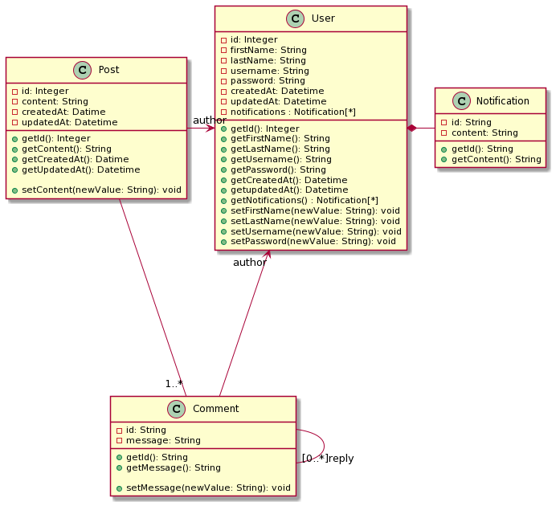

= ASK ME, un forum en ligne

Dans ce repos, vous trouverez le code source du projet. Il composé de deux parties

. link:server[] : implémentation du serveur web en Spring Boot.
. link:webapp[] : client web, codé en angular.
. link:docs[] : contient le diagramme de classe.

== Diagramme de classe

== Comment lancer le serveur ?

. Préalabement, s'assuré que Java 11+  est installé.

. Se placer dans le repertoire avec  `cd server`

. Installer les dépandances maven `./mvnw clean install`
. Lancer le serveur avec `./mvnw spring-boot:run`. Le serveur sera lancé sur `localhost:8000`

**Aucune installation de MongoDB n'est nécessaire, un cluster est déjà configuré et sera éxecuté automatiquement**.

== Comment lancer le client ?

. Préalablement, il faut s'assurer que npm est installé.
. Se placer dans le repertoire avec `cd webapp` 
. Installer les dépendances avec `npm install` ou  `yarn install` (Si vous utilisé `yarn`)
. Lancer le client avec `npm run start` ou `yarn start`. Le client sera ouvert sur `localhost:4200`